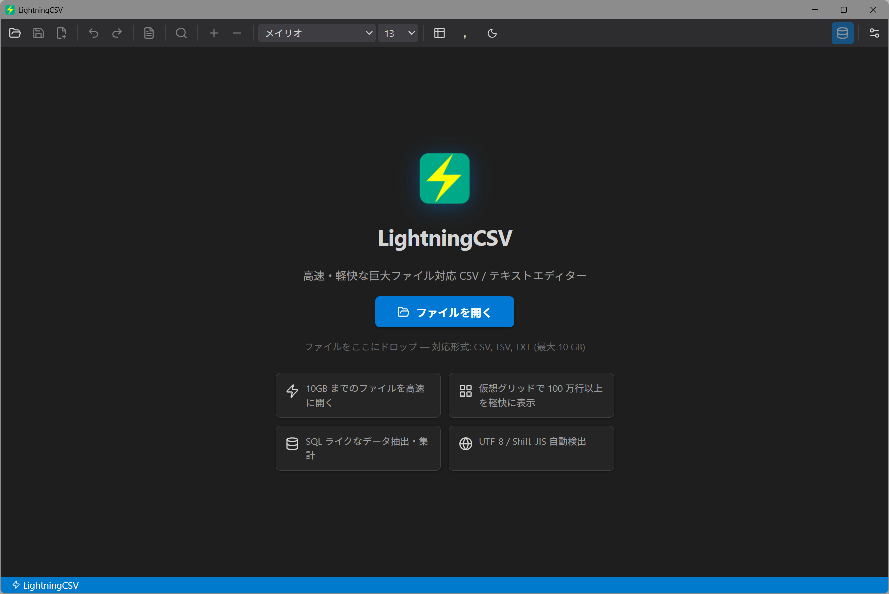
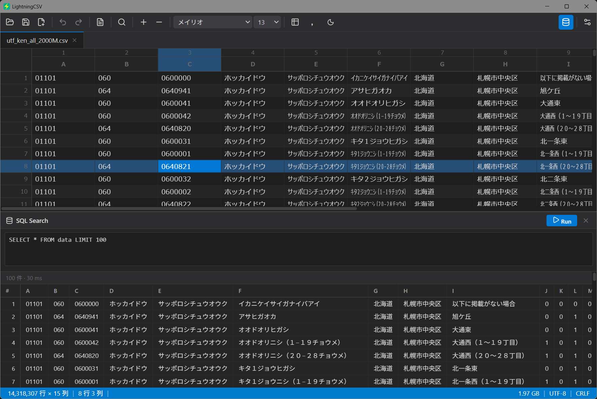

# LightningCSV
## 高速CSVエディター

  

## 概要
LightningCSV は、巨大なCSV/TSVファイルを高速表示・編集できる エディターです。  
- 10Gまでのファイルを高速に開けます
- SQLライクなデータ抽出機能搭載
- テーマ切り替え機能(ライト／ダーク)

  

  

---
## 対応プラットフォーム

| プラットフォーム | 配布形式 |
|----------------|---------|
| **Windows 10/11** | ポータブル版 |

### Windows 版

#### ポータブル版
- **ファイル名**: `LightningCSV_{バージョン番号}_windows_portable.zip`
- **特徴**:
  - インストール不要、解凍して使用可能
  - 自動更新機能実装準備中  

---
## プライバシー・セキュリティ

LightningCSV は**ユーザーのプライバシーとセキュリティを最優先**に設計されています。

### データの取り扱い

- **不正な情報収集は一切行いません**
  - ユーザーの個人情報、編集内容、使用状況などのデータを収集する機能は実装されていません
  - 使用状況の自動送信、エラーレポート送信などの機能も一切含まれていません

- **不正な外部送信は一切行いません**
  - アプリケーションが外部に送信するデータはありません。  

  ※今後実装する自動アップデート(GitHub Releases)機能使用時には  
    GitHubのこのリポジトリとの通信が発生します。

### 安全性の確認方法

このアプリケーションは、すべてのデータはユーザーのコンピュータ内で管理されます。  
データの外部送信等は行いませんが、ウィルスチェック等はご自身の責任で実施ください。

---
## サポート・フィードバック

- **Issues**: [GitHub Issues](https://github.com/Ore2Mon2/dotmd/issues)

---
## ライセンス

- このソフトウェアは MIT ライセンスの下で配布されています。詳細は [LICENSE.md](LICENSE.md) をご覧ください。

---
## 免責事項

このソフトウェアは**「現状のまま」（AS IS）**で提供されます。開発者は、明示的または黙示的を問わず、いかなる保証も行いません。

### 責任の制限

本ソフトウェアの使用により生じた、以下を含むがこれに限定されない、いかなる損害についても、開発者は一切の責任を負いません：

- **データの損失または破損**（ファイルの消失、編集内容の喪失など）
- **セキュリティインシデント**（不正アクセスなど）
- **システムの障害または誤動作**
- **その他、直接的・間接的・付随的・特別・懲罰的・派生的な損害**

### 使用上の注意

- 重要なファイルは定期的にバックアップを取ることを推奨します

**本ソフトウェアの使用は、すべてユーザーの自己責任において行われるものとします。**

---
## 📋 バージョン履歴

[GitHub Releases](https://github.com/Ore2Mon2/LightningCSV/releases)
